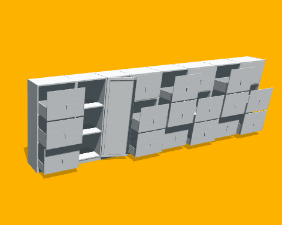

<div align="center">
</img>
</div>

# [Infinite Mobility: Scaling High-fidelity Articulated Object Synthesize using Procedural Generation]()
[**Getting Started**](#getting-started)
| [**Contributing**](#contributing)

## What is this?
This repo is about the procedural generation of articulated objects like this.
<div align="center">
</img>
</div>

## Getting Started

First, follow installation instruction of Infinigen to setup the basic environment [Installation Instructions](docs/Installation.md).  
__important: we are based on an earlier version of Infinigen.(git 572bfe7)  
It could break the pipeline if the newest version is installed__   
Then, please run setup.py to configure our dependencies.
```bash
python setup.py
```
Next, download our part dataset [here](https://github.com/yinoqifu00/Infinite-Mobility/releases/tag/v0.0.1) 
Finally, configure dataset path in [python code](infinigen/assets/utils/auxiliary_parts.py) line 30.
For example, if part dataset is /datasets/parts
```python
AUXILIARY_PATH = "/datasets/parts"
```
It should work just fine now!🎊 

## Generate
We provide a script for you to generate as many articulated objects as you like!
```bash
python paralled_generate.py <Factory Name> <Number> <MaxProcess>
```
If you want to generate 100 officechairs, and generate 10 samples at the same time, run
```bash
python paralled_generate.py OfficeChairFactory 100 10
```
Results will be in outputs folder in the form of URDF.

For Factory Name we support now, refer to the form below.
| Factory Name |
|----|
| OfficeChairFactory  |
| BarChairFactory  |
| BeverageFridgeFactory  |    
| DishwasherFactory  |  
| MicrowaveFactory  |   
| OvenFactory  | 
| TVFactory|  
| TapFactory  | 
| ToiletFactory  |  
| HardwareFactory |  
| LitedoorFactory |   
| LampFactory |  
| PlateOnRackBaseFactory |  
| KitchenCabinetFactory |   
| VaseFactory |   
| BottleFactory |   
| CocktailTableFactory |  
| DiningTableFactory| 
| PotFactory |
| PanFactory |   
| LidFactory |
| WindowFactory |  

## Visualize
```bash
python show.py <path to dir or urdf file>
```
If you want to visualize one urdf file in ./outputs/***.urdf, run
```bash
python show.py ./outputs/***.urdf
```
We also support visualize all urdfs in one dir.If you want to visualize all urdfs in ./output, run
```bash
python show.py ./outputs
```
<div align="center">
</img>
</div>

## Contributing

We welcome contributions! You can contribute in many ways:
- **Contribute code to Infinigen repository** - Procedural generators for more categories with interactive parts are still needed, we are happy to update our articulation modifications as Infinigen evolves! 
- **Contribute more diverse parts with fine geometry** - Compared to original infinigen, our work introduces substitution of certain parts with collected meshes. A more diversed parts dataset would boost our performance in many applications! 

### Getting Help
If you are having difficulties running scripts in our repo, please open issues!
We are happy to provide supports and have discussions!

## TO DO
- [ ] Make installation more self-contained
- [ ] Add usd format support
- [ ] Generate interactive environment with infinigen layout solvers.
